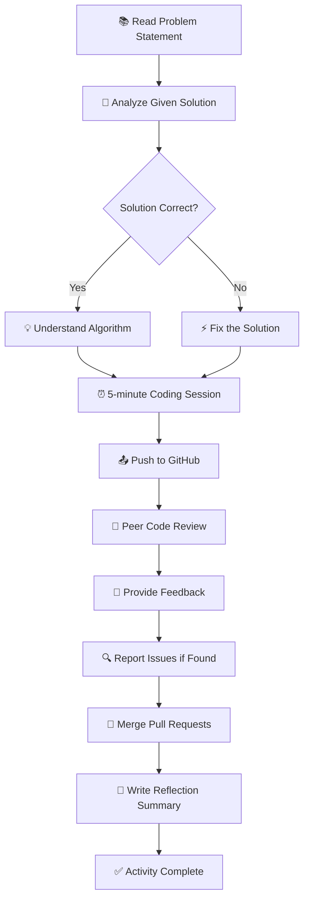
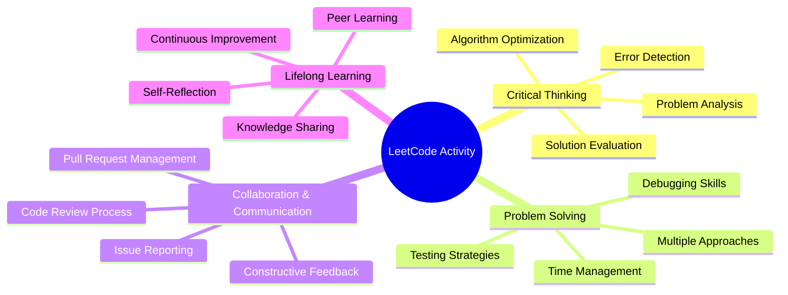

# LeetCode Collaborative Problem-Solving Activity

## 🎯 Activity Overview
กิจกรรมนี้มุ่งเน้นการพัฒนา soft skills ผ่านการแก้ปัญหาโจทย์จาก LeetCode ร่วมกัน โดยใช้กระบวนการ collaborative coding และ peer review

## 📊 Activity Flow Diagram

## 🎓 Soft Skills Development Framework

## 📋 Activity Instructions

### Phase 1: Problem Understanding & Analysis (Critical Thinking)
1. **อ่านโจทย์อย่างละเอียด** - ทำความเข้าใจ requirements และ constraints
2. **วิเคราะห์ solution ที่ให้มา** - ตรวจสอบความถูกต้องของอัลกอริทึม
3. **ใช้ programming language ที่ถนัด** - เน้นการเข้าใจมากกว่าภาษา

### Phase 2: Problem Solving Implementation
- **หากคำตอบถูกต้อง**: ศึกษาและทำความเข้าใจ logic
- **หากคำตอบไม่ถูกต้อง**: แก้ไขและปรับปรุงโซลูชัน
- **เวลาที่กำหนด**: 5 นาทีต่อข้อ (เน้นการจัดการเวลา)

### Phase 3: Collaboration & Version Control
1. **Push code ขึ้น GitHub** - เมื่อทำเสร็จแล้ว
2. **สร้าง Pull Request** - เพื่อให้เพื่อนๆ review

### Phase 4: Peer Review & Communication
หลังจากทุกคน push code แล้ว ให้ทำการ:
- **Review code ของเพื่อน** - อ่านและทำความเข้าใจ
- **Comment จุดที่น่าสนใจ** - ชื่นชมเทคนิคที่ดี
- **Suggest การปรับปรุง** - เสนอแนะการพัฒนา
- **Report issues** - รายงาน bug หรือปัญหาที่พบ

### Phase 5: Integration & Learning
- **Merge pull requests** ของเพื่อนในกลุ่ม
- **สะท้อนการเรียนรู้** - เขียนสรุปลง README.md

## 🎯 Learning Outcomes

| Soft Skills                       | Activities                            | Assessment Criteria                        |
| --------------------------------- | ------------------------------------- | ------------------------------------------ |
| **Critical Thinking**             | Problem analysis, Solution validation | การวิเคราะห์ปัญหาได้ถูกต้อง, ตรวจสอบ solution ได้ |
| **Problem Solving**               | Debugging, Algorithm implementation   | แก้ไขปัญหาได้สำเร็จ, จัดการเวลาได้ดี               |
| **Collaboration & Communication** | Code review, Constructive feedback    | ให้ feedback ที่สร้างสรรค์, ทำงานร่วมกันได้ดี        |
| **Lifelong Learning**             | Self-reflection, Peer learning        | เขียนสะท้อนการเรียนรู้ได้ชัดเจน                   |

## ⏱️ Time Management

| Phase | Duration      | Activity              |
| ----- | ------------- | --------------------- |
| 1     | 5-7 min       | Problem Analysis      |
| 2     | 5 min/problem | Coding Implementation |
| 3     | 3-5 min       | Git Operations        |
| 4     | 10-15 min     | Peer Review Process   |
| 5     | 10 min        | Reflection & Summary  |

## 🔍 Evaluation Rubric

### Code Quality (Problem Solving)
- ✅ Solution correctness
- ✅ Code readability
- ✅ Algorithm efficiency
- ✅ Error handling

### Collaboration (Communication)
- ✅ Constructive feedback quality
- ✅ Response to peer suggestions
- ✅ Professional communication
- ✅ Active participation

### Reflection (Lifelong Learning)
- ✅ Self-awareness of learning
- ✅ Identification of improvement areas
- ✅ Goal setting for future development

---

