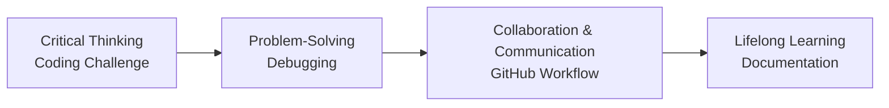

# Design Activity
- วันนี้เราจะมาทำกิจกรรมในการเเก้ปัญหาโจทย์จาก LeetCode กันครับ
- โดยผมจะมีโจทย์กับคำตอบมาให้ดูเป็นตัวอย่าง
- ใช้ Programming language ที่ถนัดได้เลยครับ
- จะให้ทุกคนอ่านโจทย์เเล้วทำความเข้าใจโจทย์ พร้อมดูตัวอย่างคำตอบว่ามันสัมพันธ์กันไหม สั้นๆ คือคำตอบมันถูกต้องไหม
- ถ้าคำตอบไม่ถูกต้อง ให้ทุกคนเริ่มเเก้โจทย์ปัญหานี้ได้เลยครับ
- กำหนดเวลาข้อละ 5 นาที
- ถ้าใครทำเสร็จเเล้ว ให้ทุกคนทำการ push code ขึ้น GitHub Host ไ้ด้เลยครับ
- หลังจากที่ทุกคนทำการ push code ขึ้น GitHub เรียบร้อยเเล้ว ให้ทุกคนทำการ
    - Review code ของเพื่อนในกลุ่ม     
    - Comment ว่า code ของเพื่อนมีจุดไหนที่น่าสนใจ
    - Suggest ว่า code ของเพื่อนมีจุดไหนที่สามารถปรับปรุงได้
    - Report issue ถ้าเจอ bug ใน code ของเพื่อน
- หลังจากนั้นให้ทุกคนทำการ merge pull request ของเพื่อนในกลุ่ม
- หลังจากที่ทุกคน merge pull request ของเพื่อนในกลุ่มเสร็จเรียบร้อยเเล้ว
- ให้ทุกคนทำการสรุปกิจกรรมในวันนี้ ว่ากิจกรรมนี้ช่วยพัฒนาทักษะอะไรบ้างลงไปยัง github host README.md ของตัวเอง

## 1. Two Sum

Given an array of integers **nums** and an integer **target**, return indices of the two numbers such that they add up to **target**.

You may assume that each input would have exactly one solution, and you may not use the same element twice.

You can return the answer in any order.

### Example 1:
```
Input: nums = [2,7,11,15], target = 9
Output: [0,1]
Explanation: Because nums[0] + nums[1] == 9, we return [0, 1].
```

### Example 2:
```
Input: nums = [3,2,4], target = 6
Output: [1,2]
```

### Example 3:
```
Input: nums = [3,3], target = 6
Output: [0,1]
```
### Constraints:

- **2 <= nums.length <= 104**
- **-109 <= nums[i] <= 109**
- **-109 <= target <= 109**
- **Only one valid answer exists.**

### Follow-up: Can you come up with an algorithm that is less than O(n2) time complexity?

## Solution
```cpp
class Solution {
public:
    vector<int> twoSum(vector<int>& nums, int target) {
        unordered_map<int, int> pairIdx;

        for (int i = 0; i < nums.size(); ++i) {
            int num = nums[i];
            if (pairIdx.find(target - num) != pairIdx.end()) {
                return {i, pairIdx[target - num]};
            }
            pairIdx[num] = i;
        }

        return {};        
    }
};
```

## 1. Median of Two Sorted Arrays

Given two sorted arrays **nums1** and **nums2** of size **m** and **n** respectively, return the median of the two sorted arrays.

The overall run time complexity should be **O(log (m+n))**.

## Example 1:
```
Input: nums1 = [1,3], nums2 = [2]
Output: 2.00000
Explanation: merged array = [1,2,3] and median is 2.
```

## Example 2:
```
Input: nums1 = [1,2], nums2 = [3,4]
Output: 2.50000
Explanation: merged array = [1,2,3,4] and median is (2 + 3) / 2 = 2.5.
```

**Constraints**:

- **nums1.length == m**
- **nums2.length == n**
- **0 <= m <= 1000**
- **0 <= n <= 1000**
- **1 <= m + n <= 2000**
- **-106 <= nums1[i], nums2[i] <= 106**

## Solution
```py
class Solution:
    def findMedianSortedArrays(self, nums1, nums2):
        # Merge the arrays into a single sorted array.
        merged = nums1 + nums2

        # Sort the merged array.
        merged.sort()

        # Calculate the total number of elements in the merged array.
        total = len(merged)

        if total % 2 == 1:
            # If the total number of elements is odd, return the middle element as the median.
            return float(merged[total // 2])
        else:
            # If the total number of elements is even, calculate the average of the two middle elements as the median.
            middle1 = merged[total // 2 - 1]
            middle2 = merged[total // 2]
            return (float(middle1) + float(middle2)) / 2.0
```

| ทักษะ                                                           | ตัวอย่างกิจกรรม                                                                       | จุดเด่น                             | ข้อควรระวัง                           |
| -------------------------------------------------------------- | ---------------------------------------------------------------------------------- | --------------------------------- | ----------------------------------- |
| **1. Critical Thinking**<br>(การคิดเชิงวิพากษ์)                    | - แก้โจทย์อัลกอริทึมเชิงตรรกะ เช่น HackerRank, LeetCode<br>- วิเคราะห์ Use Case ของระบบจริง  | ฝึกการคิดวิเคราะห์และมองปัญหาหลายมุมมอง | อย่าทำโจทย์แบบท่องจำ ให้เน้นการอธิบายเหตุผล  |
| **2. Problem-Solving**<br>(การแก้ปัญหา)                          | - ทำ Mini Project เช่น เกมเล็ก ๆ ด้วย C++<br>- Debug โปรแกรมและทำ post-mortem report    | ได้ประสบการณ์ตรงจากการลงมือทำ         | เริ่มจากโจทย์เล็กก่อนค่อย ๆ ขยาย          |
| **3. Collaboration & Communication**<br>(การทำงานเป็นทีมและสื่อสาร) | - เข้าร่วม Hackathon หรือกลุ่ม Open Source<br>- ทำโครงงานร่วมกับเพื่อนใน GitHub              | ฝึกการสื่อสารทั้งเอกสารและ code review | ต้องกำหนดบทบาทและ workflow ให้ชัดเจน    |
| **4. Lifelong Learning**<br>(การเรียนรู้ตลอดชีวิต)                  | - เขียน Blog หรือ Document อธิบายสิ่งที่เรียน<br>- ทดลองเทคโนโลยีใหม่ เช่น Docker, Next.js 15 | ทำให้ความรู้ไม่หยุดนิ่งและมีผลงานจับต้องได้   | อย่าพยายามเรียนหลายเรื่องพร้อมกันมากเกินไป |
| **5. Adaptability**<br>(ความสามารถในการปรับตัว)                    | - เปลี่ยนภาษาโปรแกรมที่ใช้ เช่น จาก C++ ไป Python<br>- เรียนรู้ Framework ใหม่ ๆ เช่น React, Vue | เตรียมพร้อมรับมือกับการเปลี่ยนแปลงในวงการ | อย่ากลัวที่จะออกจาก Comfort Zone         |




# 🧠 Social & Professional Ethics: LeetCode Problem-Solving Activity

## 📖 Project Overview

ยินดีต้อนรับสู่กิจกรรมพัฒนา **Soft Skills** ผ่านการแก้ปัญหา LeetCode แบบ Collaborative! 

กิจกรรมนี้ออกแบบมาเพื่อพัฒนาทักษะที่สำคัญ 4 ด้าน:
- 🎯 **Critical Thinking** - การคิดวิเคราะห์
- 🛠️ **Problem Solving** - การแก้ปัญหา
- 🤝 **Collaboration & Communication** - การทำงานร่วมกันและการสื่อสาร
- 📚 **Lifelong Learning** - การเรียนรู้ตลอดชีวิต

## 🎯 Mission Statement

> *"เปลี่ยนการเขียนโค้ดจากกิจกรรมเดี่ยวๆ ให้เป็นประสบการณ์การเรียนรู้แบบร่วมมือ เพื่อพัฒนาทักษะที่จำเป็นสำหรับนักพัฒนาซอฟต์แวร์ยุคใหม่"*

## 🚀 Quick Start Guide

### Prerequisites
- Git & GitHub account
- Programming language ที่ถนัด (C++, Python, Java, etc.)
- Text editor หรือ IDE
- ความพร้อมที่จะเรียนรู้และแบ่งปันความรู้

### 📁 Project Structure
```
📦 Social_and_Professional_Ethics/
├── 📁 docs/               # เอกสารคำแนะนำและแนวทางการทำกิจกรรม
│   ├── README.md          # คู่มือกิจกรรมฉบับเต็ม
│   └── idea.md           # แนวคิดและโจทย์ปัญหา
├── 📁 solutions/         # โซลูชันที่มีปัญหาให้แก้ไข
│   ├── section1.cpp      # Two Sum Problem (C++)
│   └── section2.py       # Median of Sorted Arrays (Python)
└── 📄 README.md          # เอกสารนี้
```

## 🔄 Complete Activity Lifecycle

### 🎯 Phase 1: Critical Thinking (5-7 minutes)
**Objective**: วิเคราะห์และเข้าใจปัญหา

#### 📋 Your Tasks:
1. **📖 อ่านโจทย์จาก `problems/README.md`**
   - ทำความเข้าใจ requirements และ constraints
   - ศึกษา examples และ expected outputs

2. **🔍 วิเคราะห์ Solution ที่ให้มา**
   - เปิดไฟล์ใน `problems/src` folder
   - ตรวจสอบ logic ของ algorithm
   - ทดสอบกับ test cases ที่กำหนด

3. **❓ ตั้งคำถามกับตัวเอง**
   - Solution นี้ถูกต้องหรือไม่?
   - Time complexity เป็นไปตาม requirement หรือไม่?
   - มี edge cases ที่ไม่ได้คิดถึงหรือไม่?

#### 🧠 Critical Thinking Skills Being Developed:
- Problem decomposition
- Pattern recognition  
- Logical reasoning
- Evidence evaluation

---

### 🛠️ Phase 2: Problem Solving (5 minutes per problem)
**Objective**: แก้ไขปัญหาและ optimize solution

#### 🔨 Your Tasks:
1. **🐛 Debug the Code**
   - หา bugs ที่แฝงอยู่ใน solution
   - ทำความเข้าใจสาเหตุของปัญหา
   - แก้ไข logic errors

2. **⚡ Optimize Solution** (Optional)
   - ปรับปรุง time/space complexity
   - เขียน code ให้ readable มากขึ้น
   - เพิ่ม error handling

3. **✅ Test Your Solution**
   - รัน test cases ทั้งหมด
   - สร้าง additional test cases
   - ตรวจสอบ edge cases

#### 🛠️ Problem Solving Skills Being Developed:
- Debugging techniques
- Algorithm optimization
- Testing strategies
- Time management

---

### 🤝 Phase 3: Collaboration & Version Control (3-5 minutes)
**Objective**: แบ่งปัน solution และเตรียม peer review

#### 📤 Your Tasks:
1. **Git Operations**
   ```bash
   git add solutions/
   git commit -m "Fix: [Problem Name] - [Brief description of fixes]"
   git push origin [your-branch-name]
   ```

2. **Create Pull Request**
   - สร้าง PR with descriptive title
   - เขียน description ว่าแก้อะไรบ้าง
   - ใส่ tag เพื่อนที่จะ review

#### 🔧 Version Control Skills Being Developed:
- Git workflow mastery
- Branch management
- Commit message best practices
- Pull request etiquette

---

### 💬 Phase 4: Collaboration & Communication (10-15 minutes)
**Objective**: Review และให้ feedback ซึ่งกันและกัน

#### 👥 Your Tasks:
1. **📖 Code Review Process**
   - อ่าน code ของเพื่อนอย่างละเอียด
   - ทำความเข้าใจ approach ที่เพื่อนใช้
   - เปรียบเทียบกับ solution ของตัวเอง

2. **💬 Provide Constructive Feedback**
   ```markdown
   // ตัวอย่าง Comment Template
   👍 **สิ่งที่ทำได้ดี**: [specific positive points]
   💡 **ข้อเสนอแนะ**: [constructive suggestions]
   🐛 **Issues พบ**: [bugs or problems found]
   🚀 **การปรับปรุง**: [optimization opportunities]
   ```

3. **🔍 Report Issues**
   - สร้าง GitHub Issues สำหรับ bugs ที่พบ
   - ใส่ labels และ assign ให้เจ้าของ code
   - เสนอวิธีการแก้ไข

#### 🤝 Communication Skills Being Developed:
- Constructive feedback delivery
- Technical communication
- Conflict resolution
- Team collaboration

---

### 🔀 Phase 5: Integration & Lifelong Learning (10 minutes)
**Objective**: รวม solution และสะท้อนการเรียนรู้

#### 📝 Your Tasks:
1. **Merge Pull Requests**
   - Review และ approve PR ของเพื่อน
   - Merge เข้า main branch
   - ดู merged solution รวมกัน

2. **🎓 Self-Reflection & Documentation**
   เขียนสรุปลงใน README.md ของตัวเอง:
   ```markdown
   ## 📚 Learning Reflection - [Date]
   
   ### 🎯 Problems Solved:
   - [Problem 1]: [Brief description of what you learned]
   - [Problem 2]: [Brief description of what you learned]
   
   ### 💡 Key Insights:
   - [Technical insights gained]
   - [Soft skills developed]
   
   ### 🚀 Areas for Improvement:
   - [What you want to improve next]
   
   ### 🤝 Collaboration Highlights:
   - [Best feedback received]
   - [Most helpful review you gave]
   ```

3. **📊 Skills Assessment**
   ประเมินตัวเองในแต่ละด้าน (1-5):
   - Critical Thinking: ⭐⭐⭐⭐⭐
   - Problem Solving: ⭐⭐⭐⭐⭐
   - Collaboration: ⭐⭐⭐⭐⭐
   - Communication: ⭐⭐⭐⭐⭐

#### 📚 Lifelong Learning Skills Being Developed:
- Self-reflection capabilities
- Learning documentation
- Goal setting
- Continuous improvement mindset

---

## 🏆 Success Metrics

### Individual Success:
- [ ] แก้ปัญหาได้สำเร็จภายในเวลาที่กำหนด
- [ ] ให้ feedback ที่สร้างสรรค์แก่เพื่อน
- [ ] รับ feedback และปรับปรุงได้
- [ ] เขียนการสะท้อนการเรียนรู้ได้ชัดเจน

### Team Success:
- [ ] ทุกคนมีส่วนร่วมใน code review
- [ ] มี discussion ที่สร้างสรรค์
- [ ] ช่วยเหลือกันแก้ปัญหา
- [ ] เรียนรู้จากกันและกัน

## 🎓 Learning Outcomes Summary

| Phase | Primary Skill | Secondary Skills | Tools Used |
|-------|---------------|------------------|------------|
| 1 | Critical Thinking | Analysis, Evaluation | Problem statements, Test cases |
| 2 | Problem Solving | Debugging, Optimization | IDE, Compiler, Testing |
| 3 | Collaboration | Version Control, Planning | Git, GitHub, Branching |
| 4 | Communication | Review, Feedback | PR comments, Issues, Discussion |
| 5 | Lifelong Learning | Reflection, Documentation | README, Self-assessment |

## 🔗 Quick Links

- 📖 [Full Activity Guide](./docs/README.md)
- 🧩 [Problems & Examples](./docs/idea.md)
- 💻 [Solution Files](./solutions/)
- 🎯 [Activity Instructions](./docs/README.md#-activity-instructions)

## 📞 Need Help?

1. **Technical Issues**: สร้าง GitHub Issue
2. **Activity Questions**: ดู [Activity Guide](./docs/README.md)
3. **Git Problems**: ตรวจสอบ [Git Workflow](./docs/README.md#phase-3-collaboration--version-control)

---

## 🌟 Let's Start Learning Together!

พร้อมที่จะเริ่มการเดินทางพัฒนา soft skills แล้วหรือยัง? 

1. 📖 อ่าน [Activity Guide](./docs/README.md) ฉบับเต็ม
2. 🧩 เลือกปัญหาจาก [Problems](./docs/idea.md)  
3. 💻 เปิดไฟล์ใน [Solutions](./solutions/)
4. 🚀 เริ่มต้น Phase 1: Critical Thinking!

**Remember**: การเรียนรู้ที่ดีที่สุดเกิดขึ้นเมื่อเราเรียนรู้ร่วมกัน! 🤝

---

*Last Updated: September 29, 2025*  
*Activity Version: 1.0*
